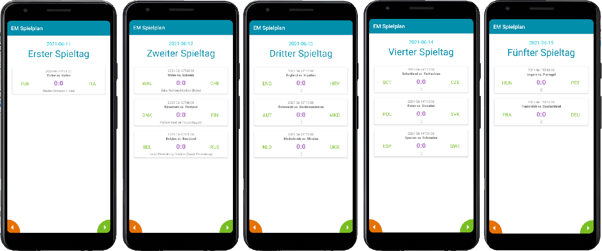

# U07 | EM-Spielplan

## Aufgabe

In knapp zwei Wochen startet die [Fußballeuropameisterschaft 2021](https://de.wikipedia.org/wiki/Fu%C3%9Fball-Europameisterschaft_2021) (_Euro 2020_). In dieser Aufgabe implementieren Sie eine App, die den Spielplan des Turniers anzeigt. Die Daten zu den einzelnen Spielen werden dabei von einer externen Quelle bezogen und via HTTP-Anfrage in die Anwendung integriert. Das _User Interface_ der Anwendung haben wir für Sie vorbereitet. Ihre Aufgabe ist das Implementieren der Datenanfrage und das Integrieren und Anzeigen der vom Server erhaltenen Informationen in die bzw. der Anwendung. Einen Eindruck der fertigen App erhalten Sie über die Screenshots am Ende dieser Beschreibung.

### Daten

Über die URL `https://em.software-engineering.education/api/getmatchdata/em20` können Sie eine JSON-formatierte Übersicht über die Spiele der Gruppenphase der Europameisterschaft herunterladen. Das Ergebniss ist ein _Array_ aus Spielen, die alle diesem Aufbau folgen:

``` json
{
"MatchID":59958,
"MatchDateTime":"2021-06-11T21:00:00",
"TimeZoneID":"W. Europe Standard Time",
"LeagueId":4457,
"LeagueName":"UEFA EURO 2020",
"MatchDateTimeUTC":"2021-06-11T19:00:00Z",
"Group":{
 "GroupName":"1. Runde Gruppenphase",
 "GroupOrderID":1,
 "GroupID":36890
},
"Team1":{
"TeamId":3205,
"TeamName":"Türkei",
"ShortName":"TUR",
"TeamIconUrl":"https://upload.wikimedia.org/wikipedia/commons/thumb/b/b4/Flag_of_Turkey.svg/2000px-Flag_of_Turkey.svg.png",
"TeamGroupName":"Gruppe A"
},
"Team2":{
"TeamId":3203,
"TeamName":"Italien",
"ShortName":"ITA",
"TeamIconUrl":"https://upload.wikimedia.org/wikipedia/en/0/03/Flag_of_Italy.svg",
"TeamGroupName":"Gruppe A"
},
"LastUpdateDateTime":"2020-11-17T12:39:27.657",
"MatchIsFinished":false,
"MatchResults":[],
"Goals":[],
"Location":{
"LocationID":378,
"LocationCity":"Rom",
"LocationStadium":"Stadio Olimpico"},
"NumberOfViewers":null},
```

Diese Daten stammen von der Webseite [openligadb.de](https://www.openligadb.de/). Wir haben diese auf unseren eigenen Server kopiert, um die offizielle API nicht durch zu viele Anfragen während der Arbeit an der Übungsaufgabe zu belasten. Der Zugriff bzw. der Aufbau "unserer" URL folgt aber dem gleichen Prinzip, das auch bei der Verwendung der offiziellen API benötigt werden würde. D.h., wenn Sie Ihre Lösung auch während der EM nutzen wollen, können Sie einfach zu *openligadb* wechseln, in dem Sie im Code nur die verwendet URL austauschen. **Beachten Sie bitte, dass die Daten noch nicht vollständig sind. Es liegen nur die Spiel für den ersten Spieltag der Gruppenphase vor.** In unserer App verstehen wir unter dem Begriff Spieltag daher erst einmal einen individuellen Tag, an dem Spiel statt finden. Sie können die Antwort des Servers auch ohne Android-App testen: Rufen Sie die URL dazu einfach in Ihrem Browser auf.

## Allgemeine Hinweise

* Verwenden Sie für die Anfragen an den Server das _Volley_-Framework, das [hier](https://developer.android.com/training/volley) näher beschrieben wird. Wir haben die _Library_ bereits in der _Gradle_-Datei des Starterpakets eingetragen.
* Die JSON-formatierte Antwort des Servers können Sie über die Funktionalitäten der Klassen [`JSONArray`](https://developer.android.com/reference/org/json/JSONArray) und [`JSONObject`](https://developer.android.com/reference/org/json/JSONObject) verarbeiten und in eigene Objekte überführen.
* Große Teile des UIs bzw. der zugehörigen Klassen sind vorgegeben. Stellen, an denen Sie im späteren Verlauf eigenen Code ergänzen müssen, sind entsprechend gekennzeichnet. Generell sind alle notwendigen Schritte grob als [TODO-Kommentare](https://www.jetbrains.com/help/idea/using-todo.html) im Code festgehalten.

## Vorgehen

### Modellierung der Java-Klassen zur Abbildung der Spiele

Vervollständigen Sie die `Match`-Klasse, um mit dieser eines der Spiele des Spielplans beschreiben zu können. Prüfen Sie dazu, welche der im JSON verfügbaren Eigenschaften für die App relevant sind und bilden Sie diese als Eigenschaften (Instanzvariablen) der Klasse ab. Erstellen Sie ggf. weitere Klassen, um komplexere Eigenschaften eines Spiels, z.B. die beteiligten Mannschaften oder den Austragungsort abzubilden. Auf den Screenshots der fertigen Anwendung bzw. in dem vom *ViewHolder* (`ui/MatchViewHolder.java`) verwendeten Layout, können Sie sehen, welche Merkmale eines Spiels später im UI angezeigt werden sollen.

**Zwischenziel:** Sie verfügen über eine Klasse `Match`, die ein einzelnes Spiel repräsentiert und dabei alle relevanten Informationen aus den JSON-formatierten Ergebnissen der Server-Anfrage abbilden kann.

### Download der Spieplandaten

Implementieren Sie eine Klasse `MatchDataProvider`, die die Spielplandaten für die restliche Anwendung bereitstellt. Führen Sie hier die eigentliche Anfrage an den API-Server durch (unter Verwendung des _Volley_-Frameworks). Wandeln Sie die JSON-formatierte Antwort des Servers in eine Liste von `Match`-Objekten um und nutzen Sie dazu die Funktionen der beiden Klassen `JSONArray` und `JSONObject`. Beachten Sie dabei, dass die Antwort des Servers auf oberster Ebene ein *JSON-Array* darstellt. Vergessen Sie nicht, im Manifest die notwendige **Permission** zur Nutzung der Internetverbindung zu ergänzen.

**Zwischenziel:** Sie verfügen über eine Klasse `MatchDataProvider`, die die aktuellen Spielinformationen vom Server beziehen und intern als `ArrayList` von `Match`-Objekten abspeichert.

### Bereitstellen der Spielplandaten

Erweitern Sie den `MatchDataProvider` um eine öffentliche Methode, mit der andere Stellen der Anwendung die Spiele eines bestimmten (Spiel-) Tages auslesen können. Nutzen Sie dazu die Datuminformationen (`MatchDateTime`), die Ihnen der Server für jedes einzelne Spiel mitteilt. Wenn Sie wissen möchten, ob ein bestimmter Zeitpunkt (`LocalDateTime`, Datum und Uhrzeit) auf einem bestimmten Tag (`LocalDate`, nur Datum) liegt, können Sie aus dem `LocalDateTime`-Objekt über dessen Methode [`toLocalDate`](https://docs.oracle.com/javase/8/docs/api/java/time/LocalDateTime.html#toLocalDate--) ein "einfacheres" `LocalDate` erstellen und beide mittels `equals`-Methode vergleichen.

**Zwischenziel:** Die Klasse `MatchDataProvider` bietet über eine öffentliche Methode die Auswahl von Spielen an einem bestimmten (Spiel-) Tag an.

### Integration in die restliche Anwendung

Sorgen Sie dafür, dass beim Start der Anwendung nun auch der `MatchDataProvider` initialisiert wird. Laden Sie zu Beginn die Spielplandaten herunter und zeigen Sie im Anschluss die Spiele des ersten Spieltags im UI an. Dazu müssen Sie dem Adapter (`MatchListRecyclerAdapter`) die passenden Spiele als ArrayList übergeben und im Vorfeld im `MatchViewHolder` die Methode zum *Binding* der Objekte an einen View überschrieben haben. Diese Ergänzungen werden in Kommentaren im Startercode genauer erklärt. Schließen Sie die Implementierung ab, in dem Sie beim Klick auf die beiden *Buttons* der Activity die aktuell dargestellten Spiele aktualisieren und entweder den vorherigen oder den nächsten Spieltag anzeigen.

## Screenshots der Anwendung


